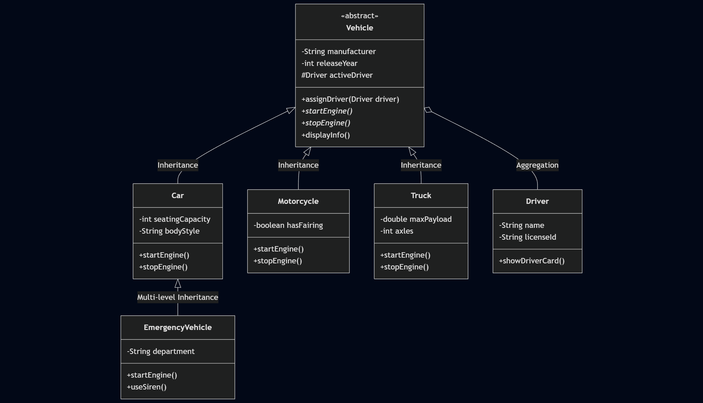

# Vehicle Management System - Assignment 2

## A. Project Overview
This project is a Java-based management system designed to demonstrate core Object-Oriented Programming (OOP) principles: **Inheritance, Abstraction, and Association**.

The system manages a fleet of vehicles tailored for the Kazakhstan region, including legendary models like the Toyota Camry 70 and KamAZ. It also handles driver assignments using aggregation, ensuring that each vehicle has an authorized operator.

## B. Class Hierarchy
The project follows a structured hierarchy to maximize code reuse and maintainability:

- **Vehicle (Abstract)**: The root superclass. It defines common attributes (`manufacturer`, `releaseYear`) and mandates that all subclasses implement `startEngine()` and `stopEngine()` methods.
- **Car**: A subclass of `Vehicle` representing passenger cars with specific attributes like `seatingCapacity`.
- **EmergencyVehicle (Bonus)**: A subclass of `Car`, demonstrating **Multi-level Inheritance** (`Vehicle` -> `Car` -> `EmergencyVehicle`). It adds specialized functionality like `useSiren()`.
- **Motorcycle & Truck**: Direct subclasses of `Vehicle` representing two-wheelers and heavy-duty transport (e.g., KamAZ).
- **Driver**: A standalone class associated with `Vehicle` through **Aggregation**, allowing one driver to be assigned to multiple vehicles.

### Access Modifiers Used:
- `private`: Applied to all fields to ensure strict **Encapsulation**. Data is only accessible through constructors or specific methods.
- `protected`: Used for the `activeDriver` field and getters (`getManufacturer()`) to allow subclasses to access parent data while keeping it hidden from the outside world.

## C. Instructions to Compile and Run
To run this project from the terminal, follow these steps:

1. Navigate to the project root directory.
2. Compile all Java files:
```bash
   javac src/*.java
```
```bash
   java -cp src Main
```
## D. Screenshots

### Program Output
The screenshot below demonstrates the successful execution of the system. It shows the polymorphic processing of the vehicle fleet, including the legendary **Toyota Camry 70**, **KamAZ**, and the **Police Hyundai Elantra**.


### UML Class Diagram
This diagram represents the final architecture of the system, highlighting the multi-level inheritance and the aggregation relationship with the Driver class.



## E. Reflection Section

**How inheritance simplified the design:**
Inheritance was the backbone of this project. It allowed me to create a single source of truth in the `Vehicle` abstract class for common data like `manufacturer` and `releaseYear`. This eliminated code duplication across all subclasses. The most significant advantage was seen when implementing the `EmergencyVehicle` class; because it inherited from `Car`, it automatically gained all passenger car features, allowing me to focus only on adding specialized emergency functions like the siren.

**How method overriding helped customize behavior:**
Method overriding allowed the system to be dynamic and realistic. Even though the `Main` program treats every object as a generic `Vehicle` inside the array, overriding the `startEngine()` method ensured that each vehicle responded according to its nature. For example, the `Truck` class simulates a heavy diesel warm-up, while the `EmergencyVehicle` simulates a radio check. This is a perfect example of polymorphism where one method call results in different, specific behaviors.

**Challenges faced when using protected and default access modifiers:**
The main challenge was balancing encapsulation with accessibility. Initially, I used `private` fields for everything, but this prevented subclasses from using the manufacturer's name in their unique engine-start messages. I had to decide between making fields `protected` or using `protected` getters. I chose the latter to maintain stricter encapsulation. This ensured that while subclasses could "read" the necessary data, they couldn't accidentally modify the core attributes of the parent class, keeping the system's state secure.